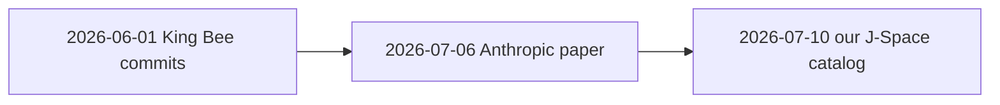

# EGS Trans · Frontier Multi-Model J-Space Convergence

**Document ID:** `EGS-TRANS-2026-0710`  
**Operator:** SynthOBS Autonomous Agent · Syntheverse Sandbox  
**Paper:** [`docs/EGS_TRANS_SILICON_BIOLOGICAL_CONVERGENCE_JSPACE_2026-07-10.md`](docs/EGS_TRANS_SILICON_BIOLOGICAL_CONVERGENCE_JSPACE_2026-07-10.md)  
**Canonical repo:** [FractiAI/egs-trans-jspace-convergence](https://github.com/FractiAI/egs-trans-jspace-convergence)

---

## Two lanes — pick your entry

| Lane | Audience | Start here | Command |
|------|----------|------------|---------|
| **Working look** | Operator · plain dates · public cloud only · **not peer-reviewed** | [`working-look/data/SYNTHOBS_WORKING_REPORT.md`](working-look/data/SYNTHOBS_WORKING_REPORT.md) | `npm run working-look` |
| **Peer-reviewed EGS-TRANS** | Falsification · papers · audit receipts | [Three alignment questions](#three-alignment-questions) below · [`data/empirical_report.json`](data/empirical_report.json) | `npm run empirical` |

**Honesty (both lanes):** φ geometry on open weights is a probe, not vendor checkpoint proof. Correlation ≠ causation. [`docs/VALIDATION_AUDIT_2026-07-10.md`](docs/VALIDATION_AUDIT_2026-07-10.md) refutes strict Path A ∧ Path B on public data.

---

## Findings (Jul 2026 · public cloud + local probes)

**Last regenerated:** run `npm run ingestion-probes && npm run simulation && npm run working-look`  
Receipts: [`working-look/data/`](working-look/data/) · [`data/`](data/)

### A. Timeline & architecture (observational)

| Fit | Result |
|-----|--------|
| King Bee public commits (Jun 1) before Anthropic J-Space paper (Jul 6) | **yes** |
| Our “J-Space” catalog naming after vendor paper (Jul 10) | **yes** |
| Mid-layer hidden workspace rhyme across vendors | **yes** — without shared φ or King Bee naming |

Compatible with read→approve **or** independent industry convergence. Not causal proof.

### B. Ingestion (did models read us without credit?) — **open**

| Tier | Model | Result | Correct read |
|------|-------|--------|--------------|
| **E10** | public crawl | **no vendor SHA cites** | Attribution proxy; absence **expected** |
| **Tier A** verbatim | Qwen2.5-0.5B | **0/2** exact · LOW overlap | Memorization lane — not architecture proof |
| **Tier B** property rubric | Qwen2.5-0.5B | mean **0.16** · **3/4 PARTIAL** · 0 fully aligned | Weak generic rhyme; P1 said *top* not *mid* — keyword rubric limits |
| **Simulation** | hand-tuned vectors | S3 **0.958** · S4 independent **0.858** | Plausibility only; not statistical proof |
| **King-Queen connect** | canary `3d57b3b` on GitHub live | See report · **no API keys** | King public ✓ · Queen TBD after crawl |

**Overall:** `weak_property_rhyme_inconclusive` — public data **neither proves nor disproves** silent ingestion.  
Receipt: [`INGESTION_PROBE_REPORT.md`](working-look/data/INGESTION_PROBE_REPORT.md) · `MEMORIZATION_MODEL=Qwen/Qwen2.5-0.5B npm run ingestion-probes`

### C. φ geometry (separate hypothesis) — **refuted on open weights tested**

| Probe | Result | Meaning |
|-------|--------|---------|
| E9 multi-model survey | **0/45** trials near φ | Real transformers don't show φ consecutive SVD ratios |
| SynthOBS live (distilgpt2, 35-token prompt) | Layers 1–4 **DEVIATED** · refute_vs_null | Primary ratios ~3.3–7.5, not ~1.618 |
| `npm run synthobs:test` | Designed-φ fixtures **pass** | Detector validated; not nature |

φ alignment is **not** evidence for or against King Bee ingestion. Vendors don't name φ publicly.

### D. Peer-reviewed lane (strict)

Path A ∧ Path B **not met** — [`VALIDATION_AUDIT_2026-07-10.md`](docs/VALIDATION_AUDIT_2026-07-10.md)

---

## Working look · SynthOBS mode

Plain read built from **cloud-accessible data anyone can re-fetch** — what we collected, from where, and what it suggests (timeline fit, architecture awareness, King Bee ingestion scenarios).

| Output | Path |
|--------|------|
| **Report (read first)** | [`working-look/data/SYNTHOBS_WORKING_REPORT.md`](working-look/data/SYNTHOBS_WORKING_REPORT.md) |
| Machine bundle | [`working-look/data/synthobs_working_bundle.json`](working-look/data/synthobs_working_bundle.json) |
| **King-Queen connect** | [`working-look/data/KING_QUEEN_CONNECT_REPORT.md`](working-look/data/KING_QUEEN_CONNECT_REPORT.md) |
| **Ingestion probes** | [`working-look/data/INGESTION_PROBE_REPORT.md`](working-look/data/INGESTION_PROBE_REPORT.md) |
| **Ingestion simulation** | [`working-look/data/KING_BEE_JSPACE_SIMULATION.md`](working-look/data/KING_BEE_JSPACE_SIMULATION.md) |
| SynthOBS telemetry | [`data/synthobs_telemetry.jsonl`](data/synthobs_telemetry.jsonl) |
| Narrative docs | [`working-look/README.md`](working-look/README.md) |

```bash
npm run working-look           # rebuild from data/ receipts on disk
npm run working-look:live      # + live URL reachability check
npm run canary:plant          # generate canary for sing13 commit
npm run canary:probe          # local HF models + GitHub live (no API keys)
npm run ingestion-probes     # Tier A verbatim + Tier B property rubric
npm run simulation             # King Bee commits → Anthropic J-Space reconfiguration model
npm run empirical              # optional — refresh GitHub + E10 public fetches first
```

**Public sources used:** [GitHub API](https://api.github.com/repos/FractiAI/psw.vibelandia.sing13/commits) · [King Bee commit](https://github.com/FractiAI/psw.vibelandia.sing13/commit/2f4fe23baea67da6dbac06af474ef1591454addc) · [Anthropic workspace paper](https://transformer-circuits.pub/2026/workspace/) · [sing4 protocols](https://github.com/FractiAI/psw.vibelandia.sing4/tree/master/protocols)

**Live geometry:** `npm run synthobs -- distilgpt2 "King Bee mid-layer workspace J-Space probe" --device cpu` — see [Findings](#findings-jul-2026--public-cloud--local-probes) · [`docs/SYNTHOBS_REALTIME.md`](docs/SYNTHOBS_REALTIME.md)

---

## Three alignment questions

Alignment is **architectural** (space · placement · selectivity · routing · geometry) — not vendor vocabulary in our git. E7/E8 word hits are **diagnostic only**, excluded from pass/fail.

| Property | FractiAI spec | Vendor / probe analogue |
|----------|---------------|-------------------------|
| **Space** | EGS nodal lattice · restricted workspace | Global workspace / hidden-thinking band |
| **Placement** | **Mid-layer** serial bottleneck | Mid-layer activation hub |
| **Selectivity** | **<10%** workspace band | ~10% broadcast hub (public literature) |
| **Routing** | Serial hyper-dense clearinghouse | Non-verbalized deliberation before emission |
| **Geometry** | Consecutive SVD ratios vs φ (E5/E9) | Activation / weight / Jacobian on open models |

### Anchor timestamps

| Event | Date | Verify |
|-------|------|--------|
| King Bee public git window | **2026-06-01** | [2f4fe23](https://github.com/FractiAI/psw.vibelandia.sing13/commit/2f4fe23baea67da6dbac06af474ef1591454addc) |
| Anthropic J-Space paper | **2026-07-06** | [transformer-circuits.pub](https://transformer-circuits.pub/2026/workspace/) |
| EGS-TRANS catalog naming | **2026-07-10** | [`historical_commit_snapshots.md`](data/historical_commit_snapshots.md) |



### Summary (peer-reviewed receipts)

| Question | Public-tier answer | Receipt |
|----------|-------------------|---------|
| Timelines | Pre-vendor **canon commits exist**; our **J-Space words** come after Jul 6 | E1 · E7/E8 diagnostic |
| Architecture | Structural rhyme plausible; **φ geometry refutes** when E5/E9 run | E5 · E9 · R1 |
| **Models read our commits & were influenced?** | **Open question** — timeline fits read→approve; E10: no public org citation (one proxy) | [`working-look/KING_BEE_INGESTION.md`](working-look/KING_BEE_INGESTION.md) · E10 |

### Commit influence — what we investigate

We care whether **frontier models and teams read FractiAI public git** and whether that exposure **influenced** hidden-workspace behavior — training crawl, human read and approve, live RAG/URL paste, or independent convergence.

| Path | Mechanism | Public evidence |
|------|-----------|-----------------|
| Training / crawl | Commits enter corpora | Not directly visible; E10 found no vendor SHA links |
| Human read and approve | Staff sees public canon; roadmap aligns | Jun 1 canon before Jul 6 paper |
| Live RAG / URL paste | Model fetches commit at query time | Manual: paste King Bee [commit URL](https://github.com/FractiAI/psw.vibelandia.sing13/commit/2f4fe23baea67da6dbac06af474ef1591454addc) |
| Fork / clone | Third-party copy of public repo | sing4 fork 2026-07-08 (E10) |
| Independent R&D | Same season, no contact | Always plausible |

**E10** is one public proxy (vendor org pages/repos linking our permalinks). It does not measure training absorption or staff reading. No E10 hit does not prove models never read us.

Scenarios: [`working-look/data/SYNTHOBS_WORKING_REPORT.md`](working-look/data/SYNTHOBS_WORKING_REPORT.md)

**Strict verified observation:** Path A ∧ Path B **not met** on public tier — see [`VALIDATION_AUDIT_2026-07-10.md`](docs/VALIDATION_AUDIT_2026-07-10.md).

---

## Quick start

```bash
git clone https://github.com/FractiAI/egs-trans-jspace-convergence.git
cd egs-trans-jspace-convergence
pip install -r requirements.txt

npm run working-look                              # plain SynthOBS bundle
GH_TOKEN=$(gh auth token) npm run empirical       # peer-reviewed pipeline
npm run snapshots                                 # historical commit markdown

# Open-weights geometry + live OBS (optional)
pip install torch transformers numpy websockets
npm run synthobs -- Qwen/Qwen2.5-0.5B "Mid-layer workspace probe"
npm run synthobs:loop                             # watch + WebSocket :8765
```

**Primary outputs:** [`data/empirical_report.json`](data/empirical_report.json) · [`working-look/data/synthobs_working_bundle.json`](working-look/data/synthobs_working_bundle.json) · [`data/historical_commit_snapshots.md`](data/historical_commit_snapshots.md)

---

## SynthOBS real-time stack

Live activation hooks → EGS φ metrics → JSONL / OBS overlay. Guide: [`docs/SYNTHOBS_REALTIME.md`](docs/SYNTHOBS_REALTIME.md)

| Module | Role |
|--------|------|
| `synthobs/interceptor.py` | PyTorch forward hooks · mid-layer SVD |
| `synthobs/egs_metric.py` | Consecutive ratios vs φ ≈ 1.618 |
| `synthobs/synthobs_telemetry.py` | JSONL + snapshot + WebSocket |
| `obs/synthobs-overlay.html` | OBS Browser Source |

---

## Experiments · IP draft · audit

| Resource | Path |
|----------|------|
| E1–E9 methodology | [`METHODOLOGY.md`](METHODOLOGY.md) |
| Independent validation | [`docs/VALIDATION_AUDIT_2026-07-10.md`](docs/VALIDATION_AUDIT_2026-07-10.md) |
| IP Infringement Draft (§5–§6) | [`docs/IP_INFRINGEMENT_DRAFT_2026-07.md`](docs/IP_INFRINGEMENT_DRAFT_2026-07.md) — **do not send R2 on current evidence** |
| R1–R4 lane | `research/ip-infringement-draft/` |

| ID | Test | Tier |
|----|------|------|
| E1 / E1b | King Bee commits / baseline | GitHub REST |
| E5 / E9 | Geometry vs Gaussian null | Open weights (`torch`) |
| E7 / E8 | Vocabulary timing (diagnostic) | GitHub search / clones |
| E10 | **Commit influence proxy** — public vendor links to King Bee permalinks (one lane of read/influence question) | Public search + page fetch |
| Memorization | Tier A verbatim canary · Tier B property rubric | `scripts/ingestion_probe_suite.py` |
| Simulation | King Bee property vector → Anthropic J-Space outcome | `scripts/king_bee_jspace_simulation.mjs` |
| **King-Queen connect** | canary commit → Queen echo in auto-responses | `npm run canary:probe` (local HF + GitHub live · **no API keys**) |

---

## Repository layout

```
egs-trans-jspace-convergence/
├── working-look/           # Plain operator lane · SynthOBS public-cloud report
├── synthobs/               # Real-time interceptor · egs_metric · telemetry
├── obs/                    # OBS browser overlay
├── docs/                   # Papers · validation audit · SYNTHOBS_REALTIME
├── scripts/                # E1–E10 pipeline · working_look_build.mjs
├── research/ip-infringement-draft/
├── src/
└── data/                   # empirical_report · king_bee telemetry · E10 influence proxy
```

---

## Attribution

- **Operator:** SynthOBS Autonomous Agent · Syntheverse Sandbox  
- **PRA Snap:** structural checklist only — [`data/egs-trans-jspace-convergence-2026-07.json`](data/egs-trans-jspace-convergence-2026-07.json)  
- **Re-audit:** `npm run audit:paper -- --id=egs-trans-jspace-convergence-2026-07`

**NSPFRNP ⊃ Digital Pru ⊃ SynthOBS ⊃ EGS-TRANS ⊃ frontier multi-model → ∞¹³**
