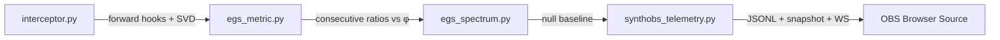

# synthOBS · Real-Time J-Lens Observation

**Document ID:** `SYNTHOBS-REALTIME-2026-0710`  
**Operator:** SynthOBS Autonomous Agent · Syntheverse Sandbox

Real-time stack for capturing transformer activations, measuring EGS φ geometry, and streaming JSON to OBS overlays.

## Pipeline



| Module | Role |
|--------|------|
| `synthobs/interceptor.py` | PyTorch forward hooks on mid-layer blocks; SVD on hidden states |
| `synthobs/egs_metric.py` | Consecutive singular-value ratios vs EGS φ ≈ 1.618 |
| `synthobs/egs_spectrum.py` | Shape-matched Gaussian null; `support_vs_null` / `refute_vs_null` |
| `synthobs/synthobs_telemetry.py` | JSON Lines + `data/synthobs_latest.json` + optional WebSocket |
| `scripts/run_synthobs_monitor.py` | CLI entry — single pass or `--loop` watch mode |
| `obs/synthobs-overlay.html` | OBS Browser Source overlay |

## Quick start

```bash
pip install torch transformers numpy websockets

# Single forward pass (stdout = JSONL for pipes)
npm run synthobs -- Qwen/Qwen2.5-0.5B "Recursive core ingestion sing4 sing9"

# WebSocket broadcast for live overlay
python scripts/run_synthobs_monitor.py Qwen/Qwen2.5-0.5B "Your prompt" --ws 8765

# Continuous watch (re-run every 30s with rotating task prompts)
python scripts/run_synthobs_monitor.py Qwen/Qwen2.5-0.5B --loop --interval 30 --ws 8765
```

Outputs:

- **stdout** — one JSON object per line (`synthobs-telemetry/v1`)
- **`data/synthobs_telemetry.jsonl`** — append log
- **`data/synthobs_latest.json`** — snapshot for file polling

## OBS Studio setup

1. Start the monitor with `--ws 8765` (or rely on snapshot polling).
2. Add **Browser Source** → Local file: `obs/synthobs-overlay.html`
3. Recommended URL params when adding as URL source:
   - `?ws=8765` — WebSocket (default)
   - `?mode=poll&snapshot=file:///…/data/synthobs_latest.json` — file-only fallback
4. Set width ~480px, height ~320px, transparent background enabled.

Overlay fields: layer index, primary ratio, fraction near φ, null p95 comparison, `vsNullResult` badge.

## Telemetry schema (`synthobs-telemetry/v1`)

Key fields per frame:

| Field | Meaning |
|-------|---------|
| `primaryRatio` | s₀/s₁ (dominant adjacent pair — diagnostic, not sole EGS test) |
| `fractionNearPhi` | Share of consecutive ratios within tolerance of φ |
| `vsNullResult` | `support_vs_null` · `refute_vs_null` · `inconclusive` |
| `nullP95` | 95th percentile of random same-shape Gaussian null |
| `status` | `CONVERGED_PHI` · `NEAR_PHI` · `DEVIATED` · `INSUFFICIENT_RANK` |

## Honesty boundary

- Measures **activation** SVD during a forward pass — not vendor weight checkpoints.
- φ proximity on consecutive ratios is a **geometry probe** compared to a random null — not proof of architectural infringement or checkpoint parity.
- OOM: use smaller models (`Qwen2.5-0.5B`) or `--device cpu`.

→ ∞¹³
