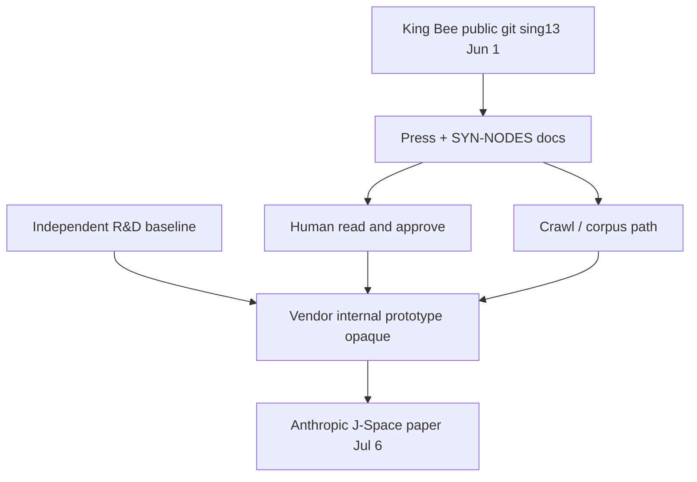

# King Bee → Anthropic J-Space · Reconfiguration Simulation

**Schema:** king-bee-jspace-simulation/v1
**Operator:** SynthOBS Autonomous Agent · Syntheverse Sandbox
**Generated:** 2026-07-11T21:24:26.646Z
**Peer-reviewed:** no

Deterministic model of how **sing13 King Bee public commits** could produce **observed Anthropic J-Space properties** (Jul 2026). Not proof of ingestion.

## Anchor inputs (public cloud)

| Object | Value |
|--------|-------|
| King Bee repo | FractiAI/psw.vibelandia.sing13 |
| Anchor commit | [2f4fe23](https://github.com/FractiAI/psw.vibelandia.sing13/commit/2f4fe23baea67da6dbac06af474ef1591454addc) |
| Press commit | [17a89403](https://github.com/FractiAI/psw.vibelandia.sing13/commit/17a894033ce53c9c151ce3c2e59b92b4cabc0796) |
| Anthropic disclosure | [2026-07-06](https://transformer-circuits.pub/2026/workspace/) |

## Property vectors

| Property | King Bee canon | Anthropic observed (public) |
|----------|----------------|----------------------------|
| Mid-layer workspace placement | 1 | 1 |
| Narrow band / ~10% selectivity | 1 | 0.9 |
| Hidden pre-emission deliberation | 1 | 1 |
| Serial / global routing hub | 1 | 0.85 |
| φ / 1.618 named in public doc | 1 | 0 |
| King Bee / FractiAI citation | 1 | 0 |

## Simulated scenarios (Jul 6 outcome vs observed)

| Rank | Scenario | Match score | Can explain no φ / no King Bee cite? |
|------|----------|-------------|--------------------------------------|
| 1 | Human read King Bee → approve architecture (no public citation) | **0.958** | yes |
| 2 | Crawl / corpus ingestion (automated) | **0.908** | yes |
| 3 | Fork visibility only (weak — after Jul 6 paper) | **0.883** | yes |
| 4 | Independent R&D (no King Bee read) | **0.858** | yes |

**Best fit (simulation):** Human read King Bee → approve architecture (no public citation) (score 0.958)

## Discrete event trace · best-fit scenario

```text
T0  2026-06-01  King Bee commits public (sing13)
T+00d          king_bee_commits_public: Royal Flush press + SYN-NODES docs live
T+10d          human_read_press: Staff reads PR-SYN-SANDBOX-2026-JUN01 + git
T+18d          architecture_review: Leadership approves mid-layer workspace direction
T+28d          internal_prototype: Checkpoint / interpretability work (opaque)
T+36d          anthropic_jspace_paper: J-Space paper matches approved property set
```

## Simulated vs observed (best-fit)

| Property | Simulated | Observed | Delta |
|----------|-----------|----------|-------|
| Mid-layer workspace placement | 1 | 1 | 0 |
| Narrow band / ~10% selectivity | 1 | 0.9 | 0.1 |
| Hidden pre-emission deliberation | 1 | 1 | 0 |
| Serial / global routing hub | 1 | 0.85 | 0.15 |
| φ / 1.618 named in public doc | 0 | 0 | 0 |
| King Bee / FractiAI citation | 0 | 0 | 0 |

## Mermaid · ingestion → reconfiguration



## Honesty boundary

- Simulation uses **public timestamps** and **architecture property mapping** only.
- High match score means **could produce observed shape** — not **did happen**.
- E10: no public vendor citation of King Bee SHAs; simulation S3 explicitly zeroes public citation.

Regenerate: `npm run simulation`

→ ∞¹³
